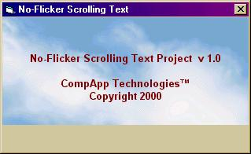



## No\-Flicker Scrolling Text

### Description

This project, gives an example on how to scroll text without flicker in a picture box. It's possible (but very awkward) to do this on a form, but in a picture box, you can have whatever background you like without messing around with paint events and such or hiding/showing parts of the picture directly on the form. Let me know what your think.
 
### More Info
 

             |
---                |---
**Submitted On**   |2001-04-28 23:29:08
**By**             |[Eric O'Sullivan](https://github.com/Planet-Source-Code/PSCIndex/blob/master/ByAuthor/eric-o-sullivan.md)
**Level**          |Advanced
**User Rating**    |4.8 (24 globes from 5 users)
**Compatibility**  |VB 5\.0, VB 6\.0
**Category**       |[Graphics](https://github.com/Planet-Source-Code/PSCIndex/blob/master/ByCategory/graphics__1-46.md)
**World**          |[Visual Basic](https://github.com/Planet-Source-Code/PSCIndex/blob/master/ByWorld/visual-basic.md)
**Archive File**   |[No\-Flicker19073512001\.zip](https://github.com/Planet-Source-Code/eric-o-sullivan-no-flicker-scrolling-text__1-22844/archive/master.zip)

